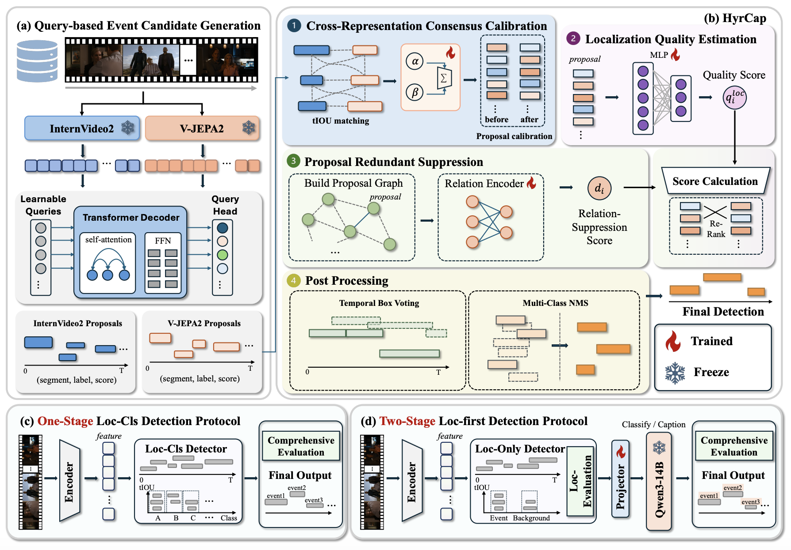

# HyrCap

This repository contains the official implementation of the paper HyrCap: Hybrid Rank-Calibration of Action
Proposals for Temporal Event Understanding.





## Included code

```text
.
├── config/
├── datasets/
├── models/
├── util/
├── scripts/
│   ├── data_download.sh
│   └── quick_start.sh
└── main.py
```

## Installation

Use Python 3.12 and a PyTorch 2.6 build compatible with your hardware. Keep a
vendor-provided PyTorch build when the accelerator requires one.

```bash
pip install -r requirements.txt
```

Set up the runtime environment and build the native operators:

```bash
source scripts/env.sh
bash scripts/build_ops.sh
```

## Quick Start

To have a quick start, run the following commands to download the matching pre-extracted THUMOS14 features and train the model.
For the dataset format, refer to [ActionFormer](https://github.com/happyharrycn/actionformer_release).

```bash
bash scripts/data_download.sh
bash scripts/quick_start.sh
```

## Training

To train the HyrCap model on the THUMOS14 dataset, execute the following command:

```bash
python3 main.py \
  --mode train \
  --config config/hyrcap/thumos14.py \
  --data-root "$HYRCAP_DATA_ROOT" \
  --output-dir "$TRAIN_OUTPUT"
```

## Evaluation

To evaluate the trained model and obtain performance metrics, use the following command structure:

```bash
python3 main.py \
  --mode eval \
  --config config/hyrcap/thumos14.py \
  --data-root "$HYRCAP_DATA_ROOT" \
  --checkpoint "$HYRCAP_CHECKPOINT" \
  --output-dir "$EVAL_OUTPUT"
```
